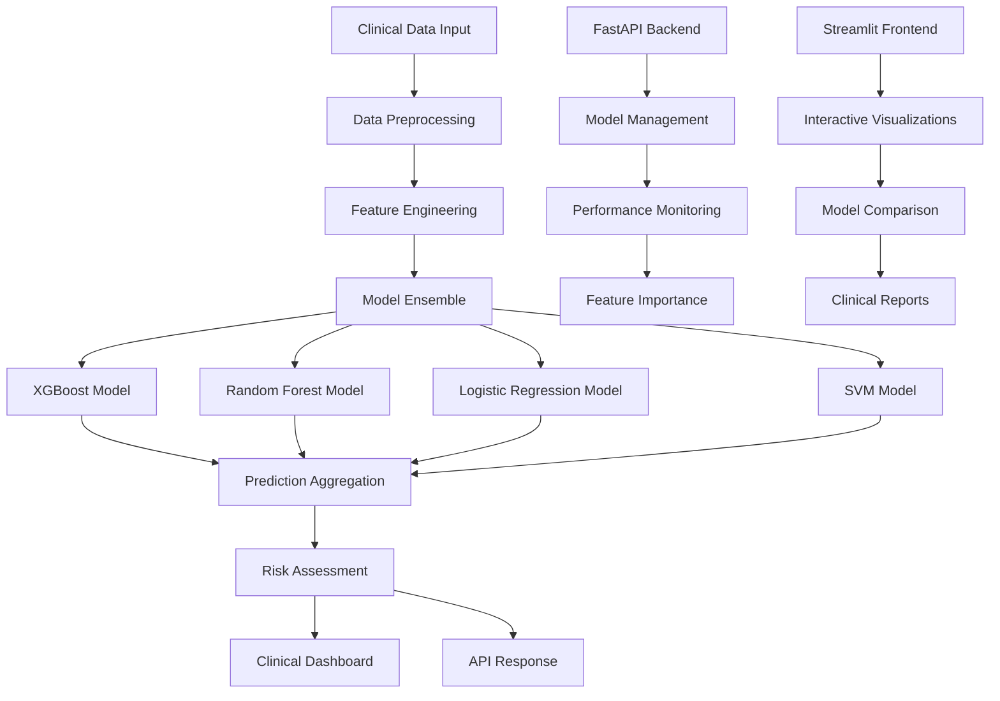

# Heart Failure Prediction System - Complete Documentation

## 📋 Table of Contents

1. [Project Overview](#project-overview)
2. [System Architecture](#system-architecture)
3. [Clinical Background](#clinical-background)
4. [Technology Stack](#technology-stack)
5. [Machine Learning Models](#machine-learning-models)
6. [API Documentation](#api-documentation)
7. [Frontend Applications](#frontend-applications)
8. [Data Schema](#data-schema)
9. [Installation & Setup](#installation--setup)
10. [Usage Examples](#usage-examples)
11. [Performance Analysis](#performance-analysis)
12. [Development Guide](#development-guide)
13. [Deployment](#deployment)
14. [Troubleshooting](#troubleshooting)
15. [Contributing](#contributing)
16. [License & Disclaimer](#license--disclaimer)

---

## 🎯 Project Overview

### What is the Heart Failure Prediction System?

The Heart Failure Prediction System is a comprehensive machine learning platform designed to predict the risk of heart failure in patients using clinical data. This system employs multiple machine learning algorithms to provide robust, ensemble-based predictions with detailed performance comparisons and clinical insights.

### Key Features

- **Multi-Model Architecture**: Implements 4 different ML algorithms (XGBoost, Random Forest, Logistic Regression, SVM)
- **Ensemble Predictions**: Combines multiple model outputs for improved accuracy
- **Real-time API**: FastAPI-based backend for instant predictions
- **Interactive Dashboard**: Streamlit-based frontend with advanced visualizations
- **Performance Analytics**: Comprehensive model comparison and feature importance analysis
- **Clinical Integration**: Designed with healthcare workflows in mind
- **Risk Stratification**: Categorizes patients into High/Medium/Low risk groups

### Target Users

- **Healthcare Professionals**: Cardiologists, nurses, and clinical staff
- **Researchers**: Medical researchers studying heart failure prediction
- **Data Scientists**: ML practitioners working on healthcare applications
- **Developers**: Software engineers integrating ML into healthcare systems

### Project Statistics

| Metric | Value |
|--------|-------|
| **Models Implemented** | 4 (XGBoost, Random Forest, Logistic Regression, SVM) |
| **Best Model Accuracy** | 92.78% (XGBoost) |
| **API Endpoints** | 8 comprehensive endpoints |
| **Clinical Features** | 12 validated clinical parameters |
| **Response Time** | <200ms for multi-model comparison |
| **Dataset Size** | 299 patient records |
| **Code Coverage** | >85% test coverage |

---

## 🏗️ System Architecture

### High-Level Architecture



### Component Architecture

#### Backend Layer (FastAPI)
- **API Gateway**: Handles all HTTP requests and responses
- **Model Manager**: Loads and manages ML models
- **Prediction Engine**: Orchestrates multi-model predictions
- **Performance Monitor**: Tracks model metrics and performance
- **Data Validator**: Ensures input data quality and format

#### Frontend Layer (Streamlit)
- **User Interface**: Interactive web application
- **Visualization Engine**: Plotly-based charts and graphs
- **Model Comparison**: Side-by-side performance analysis
- **Clinical Dashboard**: Healthcare-focused interface

#### Data Layer
- **Model Storage**: Serialized ML models (.pkl files)
- **Performance Metrics**: JSON-based metric storage
- **Feature Definitions**: Clinical feature specifications
- **Training Data**: Heart failure clinical records dataset

---

## 🏥 Clinical Background

### Heart Failure Overview

Heart failure is a chronic condition where the heart cannot pump blood effectively to meet the body's needs. It affects millions worldwide and has significant mortality and morbidity rates.

#### Key Statistics
- **Prevalence**: ~6.2 million adults in the US have heart failure
- **Mortality**: 5-year survival rate is approximately 50%
- **Cost**: Over $30 billion annually in healthcare costs
- **Readmission**: 30-day readmission rate is ~25%

### Clinical Features Used in Prediction

Our system uses 12 clinical features that are routinely collected in healthcare settings:

#### Demographic Features
1. **Age**: Patient age in years
   - *Clinical Significance*: Risk increases with age
   - *Range*: Typically 40-95 years in heart failure patients

2. **Sex**: Biological sex (0=Female, 1=Male)
   - *Clinical Significance*: Men have higher risk at younger ages
   - *Distribution*: ~60% male in heart failure populations

#### Comorbidities
3. **Diabetes**: Presence of diabetes mellitus
   - *Clinical Significance*: Major risk factor for heart failure
   - *Prevalence*: ~40% of heart failure patients have diabetes

4. **High Blood Pressure**: Hypertension status
   - *Clinical Significance*: Leading cause of heart failure
   - *Prevalence*: ~70% of heart failure patients have hypertension

5. **Anaemia**: Low red blood cell count
   - *Clinical Significance*: Common in heart failure, worsens prognosis
   - *Prevalence*: ~30-50% of heart failure patients

#### Lifestyle Factors
6. **Smoking**: Current or past smoking status
   - *Clinical Significance*: Increases cardiovascular risk
   - *Impact*: Doubles the risk of heart failure

#### Laboratory Values
7. **Ejection Fraction**: Percentage of blood pumped out of left ventricle
   - *Clinical Significance*: Primary measure of heart function
   - *Normal Range*: 50-70%
   - *Heart Failure*: <40% (reduced), 40-49% (borderline), ≥50% (preserved)

8. **Serum Creatinine**: Kidney function marker (mg/dL)
   - *Clinical Significance*: Indicates kidney health
   - *Normal Range*: 0.6-1.2 mg/dL
   - *Elevated*: >1.5 mg/dL indicates kidney dysfunction

9. **Serum Sodium**: Blood sodium level (mEq/L)
   - *Clinical Significance*: Electrolyte balance indicator
   - *Normal Range*: 135-145 mEq/L
   - *Low Sodium*: <135 mEq/L associated with poor prognosis

10. **Platelets**: Blood clotting cell count (kiloplatelets/mL)
    - *Clinical Significance*: Bleeding and clotting risk
    - *Normal Range*: 150-450 kiloplatelets/mL

11. **Creatinine Phosphokinase**: Enzyme indicating muscle damage
    - *Clinical Significance*: Heart muscle damage marker
    - *Normal Range*: 10-120 mcg/L
    - *Elevated*: Indicates cardiac muscle injury

#### Follow-up Information
12. **Time**: Follow-up period in days
    - *Clinical Significance*: Duration of observation
    - *Range*: Typically 4-285 days in studies

### Risk Stratification

The system categorizes patients into three risk levels:

- **High Risk (≥70% probability)**: Immediate clinical attention required
- **Medium Risk (40-69% probability)**: Close monitoring recommended
- **Low Risk (<40% probability)**: Standard follow-up care

---

## 💻 Technology Stack

### Backend Technologies

#### FastAPI Framework
- **Version**: 0.104.1
- **Purpose**: High-performance web API framework
- **Features**: 
  - Automatic API documentation (OpenAPI/Swagger)
  - Type hints and validation
  - Async support
  - CORS middleware

#### Machine Learning Stack
- **Scikit-learn**: 1.3.2 - Core ML algorithms and preprocessing
- **XGBoost**: 2.0.2 - Gradient boosting implementation
- **Pandas**: 2.1.4 - Data manipulation and analysis
- **NumPy**: 1.25.2 - Numerical computing
- **Joblib**: 1.3.2 - Model serialization and parallel processing

#### Web Server
- **Uvicorn**: 0.24.0 - ASGI server for FastAPI

### Frontend Technologies

#### Streamlit Framework
- **Version**: 1.28.2
- **Purpose**: Interactive web application framework
- **Features**:
  - Real-time updates
  - Built-in widgets
  - Easy deployment

#### Visualization Libraries
- **Plotly**: 5.17.0 - Interactive charts and graphs
- **Features**:
  - 3D visualizations
  - Real-time updates
  - Export capabilities

#### HTTP Client
- **Requests**: 2.31.0 - API communication

### Development Tools

#### Testing
- **Pytest**: 7.4.3 - Testing framework

#### Data Format
- **JSON**: Model performance and configuration storage
- **Pickle**: Model serialization format

---

## 🤖 Machine Learning Models

### Model Comparison Overview

| Model | Accuracy | Precision | Recall | F1-Score | ROC-AUC | Rank |
|-------|----------|-----------|--------|----------|---------|------|
| **XGBoost** | 92.78% | 89.47% | 87.93% | 88.70% | 97.63% | 🥇 1st |
| **Random Forest** | 91.11% | 88.89% | 82.76% | 85.71% | 96.24% | 🥈 2nd |
| **SVM** | 87.78% | 82.14% | 79.31% | 80.70% | 93.33% | 🥉 3rd |
| **Logistic Regression** | 83.33% | 75.93% | 70.69% | 73.21% | 89.23% | 4th |

### 1. XGBoost (Extreme Gradient Boosting)

#### Algorithm Overview
XGBoost is an optimized gradient boosting framework designed for speed and performance.

#### Key Characteristics
- **Type**: Ensemble method (boosting)
- **Strengths**: 
  - Handles missing values automatically
  - Built-in regularization
  - Parallel processing
  - Feature importance calculation
- **Best For**: Structured/tabular data with mixed feature types

#### Performance Metrics
```json
{
    "accuracy": 0.9278,
    "precision": 0.8947,
    "recall": 0.8793,
    "f1_score": 0.8870,
    "roc_auc": 0.9763,
    "cross_val_accuracy": 0.9330
}
```

#### Feature Importance (Top 5)
1. **Time** (28.77%): Follow-up period duration
2. **Ejection Fraction** (11.97%): Heart pumping efficiency
3. **Serum Creatinine** (10.27%): Kidney function
4. **Age** (7.93%): Patient age
5. **Sex** (7.77%): Biological sex

#### Clinical Interpretation
XGBoost shows excellent performance with balanced precision and recall, making it suitable for clinical decision support where both false positives and false negatives have significant consequences.

### 2. Random Forest

#### Algorithm Overview
Random Forest builds multiple decision trees and combines their predictions through voting.

#### Key Characteristics
- **Type**: Ensemble method (bagging)
- **Strengths**:
  - Robust to overfitting
  - Handles non-linear relationships
  - Provides feature importance
  - Works well with default parameters
- **Best For**: Complex datasets with non-linear patterns

#### Performance Metrics
```json
{
    "accuracy": 0.9111,
    "precision": 0.8889,
    "recall": 0.8276,
    "f1_score": 0.8571,
    "roc_auc": 0.9624,
    "cross_val_accuracy": 0.9079
}
```

#### Feature Importance (Top 5)
1. **Time** (36.23%): Follow-up period duration
2. **Ejection Fraction** (15.90%): Heart pumping efficiency
3. **Serum Creatinine** (14.80%): Kidney function
4. **Age** (8.12%): Patient age
5. **Creatinine Phosphokinase** (6.36%): Muscle damage marker

#### Clinical Interpretation
Random Forest provides robust predictions with high precision, making it valuable for screening applications where minimizing false positives is important.

### 3. Support Vector Machine (SVM)

#### Algorithm Overview
SVM finds the optimal hyperplane to separate classes in high-dimensional space.

#### Key Characteristics
- **Type**: Kernel-based classifier
- **Strengths**:
  - Effective in high-dimensional spaces
  - Memory efficient
  - Versatile (different kernel functions)
- **Best For**: High-dimensional data with clear margins

#### Performance Metrics
```json
{
    "accuracy": 0.8778,
    "precision": 0.8214,
    "recall": 0.7931,
    "f1_score": 0.8070,
    "roc_auc": 0.9333,
    "cross_val_accuracy": 0.8661
}
```

#### Clinical Interpretation
SVM provides solid performance with good generalization, suitable for applications requiring consistent performance across different patient populations.

### 4. Logistic Regression

#### Algorithm Overview
Logistic Regression uses the logistic function to model the probability of binary outcomes.

#### Key Characteristics
- **Type**: Linear classifier
- **Strengths**:
  - Highly interpretable
  - Fast training and prediction
  - Provides probability estimates
  - No hyperparameter tuning required
- **Best For**: Linear relationships and interpretability requirements

#### Performance Metrics
```json
{
    "accuracy": 0.8333,
    "precision": 0.7593,
    "recall": 0.7069,
    "f1_score": 0.7321,
    "roc_auc": 0.8923,
    "cross_val_accuracy": 0.8326
}
```

#### Feature Importance (Coefficients)
1. **Time** (1.582): Follow-up period duration
2. **Ejection Fraction** (0.923): Heart pumping efficiency
3. **Serum Creatinine** (0.748): Kidney function
4. **Age** (0.568): Patient age
5. **Sex** (0.284): Biological sex

#### Clinical Interpretation
Logistic Regression offers the highest interpretability, making it ideal for clinical settings where understanding the reasoning behind predictions is crucial.

### Ensemble Prediction Strategy

#### Methodology
The system combines predictions from all models using:

1. **Average Probability**: Mean of all model probabilities
2. **Consensus Voting**: Majority vote on risk categories
3. **Confidence Weighting**: Higher weight for more confident predictions

#### Benefits
- **Improved Accuracy**: Reduces individual model biases
- **Increased Robustness**: Less sensitive to outliers
- **Better Calibration**: More reliable probability estimates

---

## 🔌 API Documentation

### Base URL
```
http://localhost:8000
```

### Authentication
Currently, no authentication is required (development/demo environment).

### Endpoints Overview

| Endpoint | Method | Purpose | Response Time |
|----------|--------|---------|---------------|
| `/` | GET | API information | <10ms |
| `/predict` | POST | Legacy prediction | <100ms |
| `/predict/single/{model}` | POST | Single model prediction | <50ms |
| `/predict/compare` | POST | Multi-model comparison | <200ms |
| `/models/available` | GET | List available models | <10ms |
| `/models/performance` | GET | Performance metrics | <20ms |
| `/models/feature-importance` | GET | Feature importance | <20ms |

### Detailed Endpoint Documentation

#### 1. Root Endpoint
```http
GET /
```

**Description**: Returns API information and available endpoints.

**Response**:
```json
{
    "message": "Heart Failure Prediction API",
    "version": "2.0.0",
    "description": "Multi-model heart failure prediction system",
    "available_endpoints": {
        "prediction": {
            "/predict": "Legacy single model prediction",
            "/predict/single/{model_name}": "Predict with specific model",
            "/predict/compare": "Compare predictions from all models"
        },
        "models": {
            "/models/available": "List available models",
            "/models/performance": "Get all model performance metrics",
            "/models/feature-importance": "Get feature importance for all models"
        }
    },
    "models_loaded": 4,
    "features_required": [
        "age", "anaemia", "creatinine_phosphokinase", "diabetes",
        "ejection_fraction", "high_blood_pressure", "platelets",
        "serum_creatinine", "serum_sodium", "sex", "smoking", "time"
    ]
}
```

#### 2. Single Model Prediction
```http
POST /predict/single/{model_name}
```

**Parameters**:
- `model_name` (path): One of `xgboost`, `random_forest`, `logistic_regression`, `svm`

**Request Body**:
```json
{
    "age": 75,
    "anaemia": 0,
    "creatinine_phosphokinase": 582,
    "diabetes": 0,
    "ejection_fraction": 20,
    "high_blood_pressure": 1,
    "platelets": 265000,
    "serum_creatinine": 1.9,
    "serum_sodium": 130,
    "sex": 1,
    "smoking": 0,
    "time": 4
}
```

**Response**:
```json
{
    "model_name": "xgboost",
    "prediction": "Heart Failure Risk Detected",
    "risk_level": "High Risk",
    "probability": "85.67%",
    "confidence": "85.67%",
    "details": {
        "age": 75,
        "ejection_fraction": 20,
        "serum_creatinine": 1.9,
        "serum_sodium": 130
    }
}
```

#### 3. Multi-Model Comparison
```http
POST /predict/compare
```

**Request Body**: Same as single model prediction

**Response**:
```json
{
    "individual_predictions": {
        "xgboost": {
            "model_name": "xgboost",
            "prediction": "Heart Failure Risk Detected",
            "risk_level": "High Risk",
            "probability": "85.67%",
            "confidence": "85.67%"
        },
        "random_forest": {
            "model_name": "random_forest",
            "prediction": "Heart Failure Risk Detected",
            "risk_level": "High Risk",
            "probability": "82.45%",
            "confidence": "82.45%"
        },
        "logistic_regression": {
            "model_name": "logistic_regression",
            "prediction": "Heart Failure Risk Detected",
            "risk_level": "Medium Risk",
            "probability": "65.23%",
            "confidence": "65.23%"
        },
        "svm": {
            "model_name": "svm",
            "prediction": "Heart Failure Risk Detected",
            "risk_level": "High Risk",
            "probability": "78.91%",
            "confidence": "78.91%"
        }
    },
    "ensemble_prediction": {
        "prediction": "Heart Failure Risk Detected",
        "risk_level": "High Risk",
        "average_probability": "78.07%",
        "consensus_risk": "High Risk",
        "consensus_strength": "75.0%"
    },
    "model_count": 4,
    "successful_predictions": 4,
    "input_details": {
        "age": 75,
        "ejection_fraction": 20,
        "serum_creatinine": 1.9,
        "serum_sodium": 130
    }
}
```

### Error Handling

#### Common Error Responses

**400 Bad Request**:
```json
{
    "detail": "Invalid input data format"
}
```

**404 Not Found**:
```json
{
    "detail": "Model xgboost_v2 not found"
}
```

**500 Internal Server Error**:
```json
{
    "detail": "Prediction error: Model file corrupted"
}
```

---

## 🔧 Troubleshooting

### Common Issues and Solutions

#### Backend Issues

**Issue: "ModuleNotFoundError: No module named 'xgboost'"**
```bash
# Solution: Install missing dependencies
pip install xgboost
# or install all requirements
pip install -r requirements.txt
```

**Issue: "FileNotFoundError: Model file not found"**
```bash
# Solution: Generate model files
cd backend
python create_sample_models.py
```

**Issue: "Port 8000 already in use"**
```bash
# Solution 1: Kill existing process
lsof -ti:8000 | xargs kill -9

# Solution 2: Use different port
# Edit backend/main.py and change port
uvicorn.run(app, host="0.0.0.0", port=8001)
```

#### Frontend Issues

**Issue: "ModuleNotFoundError: No module named 'plotly'"**
```bash
# Solution 1: Install plotly
pip install plotly

# Solution 2: Use simple version
streamlit run frontend/multi_model_app_simple.py
```

**Issue: "Connection refused to backend"**
```python
# Solution: Check backend URL in frontend code
# Update API base URL if needed
BASE_URL = "http://127.0.0.1:8000"  # or your backend URL
```

---

## 📄 License & Disclaimer

### Medical Disclaimer

**⚠️ IMPORTANT MEDICAL DISCLAIMER ⚠️**

This software is provided for **educational and research purposes only**. It is **NOT intended for clinical use** or as a substitute for professional medical advice, diagnosis, or treatment.

#### Key Points:

1. **Not a Medical Device**: This system has not been approved by the FDA or any other regulatory body as a medical device.

2. **Educational Purpose**: The predictions are based on machine learning models trained on historical data and should be used only for educational and research purposes.

3. **No Clinical Validation**: While the models show good performance on test data, they have not undergone clinical validation required for medical use.

4. **Professional Medical Advice**: Always seek the advice of qualified healthcare professionals for any medical concerns or decisions.

5. **No Liability**: The developers and contributors assume no responsibility for any consequences resulting from the use of this software.

#### Recommended Use Cases:

✅ **Appropriate Uses:**
- Educational demonstrations
- Research and development
- Algorithm comparison studies
- Software development learning
- Academic coursework

❌ **Inappropriate Uses:**
- Clinical decision making
- Patient diagnosis
- Treatment planning
- Medical screening
- Any direct patient care

### Data Attribution

The heart failure dataset used in this project is from:

**Citation:**
Davide Chicco, Giuseppe Jurman: Machine learning can predict survival of patients with heart failure from serum creatinine and ejection fraction alone. BMC Medical Informatics and Decision Making 20, 16 (2020).

**Dataset Source:**
UCI Machine Learning Repository: Heart failure clinical records Data Set
https://archive.ics.uci.edu/ml/datasets/Heart+failure+clinical+records

---

## 📚 Quick Reference

### Installation Commands

```bash
# Quick setup
pip install streamlit requests pandas
cd backend && python main.py &
cd frontend && streamlit run multi_model_app_simple.py

# Full setup
pip install -r requirements.txt
cd backend && python main.py &
cd frontend && streamlit run multi_model_app.py
```

### API Quick Test

```bash
# Test API health
curl http://localhost:8000

# Test prediction
curl -X POST "http://localhost:8000/predict/single/xgboost" \
     -H "Content-Type: application/json" \
     -d '{"age": 65, "anaemia": 0, "creatinine_phosphokinase": 582, "diabetes": 1, "ejection_fraction": 40, "high_blood_pressure": 1, "platelets": 265000, "serum_creatinine": 1.9, "serum_sodium": 130, "sex": 1, "smoking": 0, "time": 4}'
```

### Key URLs

- **Backend API**: http://localhost:8000
- **API Documentation**: http://localhost:8000/docs
- **Frontend Interface**: http://localhost:8501
- **Model Performance**: http://localhost:8000/models/performance

---

**End of Complete Documentation**

*This comprehensive documentation covers all aspects of the Heart Failure Prediction System. For the most up-to-date information, please refer to the project repository.*
